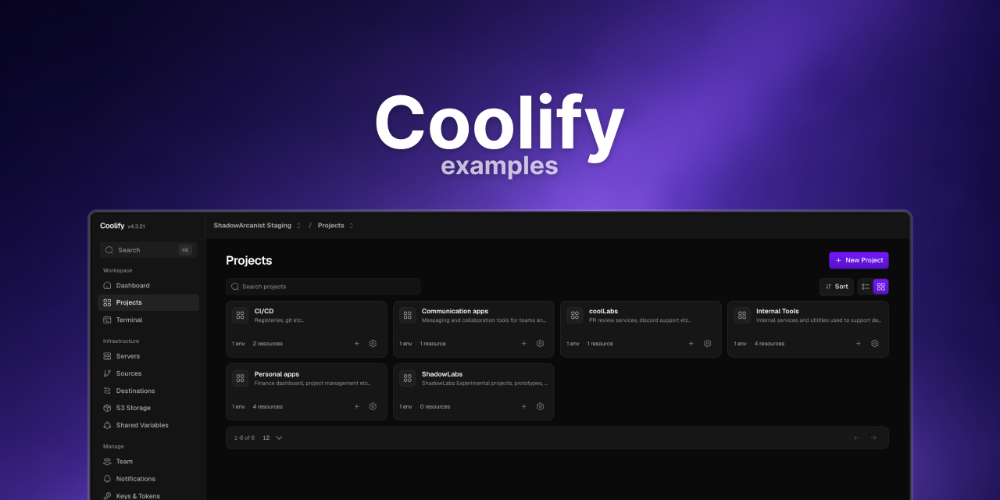

# Coolify Examples

This repository contains examples of how to deploy applications using [Coolify](https://coolify.io).

The examples are grouped as **language / example**. A language keeps a
category level (such as `frameworks/`) only when it has more than one category.

## Structure

### javascript/
| Category | Examples |
| --- | --- |
| `frameworks/` | `adonisjs`, `astro`, `nestjs`, `nextjs`, `nuxt`, `remix`, `strapi`, `t3-app`, `t3-nextauth`, `vue` |
| `monorepos/` | `turbo-nextjs`, `turbo-t3-nextauth` |
| `build-tools/` | `vite` |
| `runtimes/` | `bun`, `nodejs` |

### php/
| Type | Examples |
| --- | --- |
| Frameworks | `laravel`, `laravel-inertia`, `laravel-pure`, `symfony` |
| CMS | `shopware6` (built with Symfony) |

### Other languages
| Path | Example |
| --- | --- |
| `python/` | `flask` |
| `ruby/` | `rails` |
| `elixir/` | `phoenix` |
| `go/` | `gin` |
| `rust/` | `rocket` |

### Build methods and static
| Path | Examples |
| --- | --- |
| `dockerfile/` | `single-stage`, `multi-stage` |
| `static/` | Plain static HTML site |
| `github-actions/` | Build with GitHub Actions and deploy to Coolify |

## Internal

The `internal/` folder holds Docker Compose test fixtures and issue reproducers
for the Coolify compose parser. These are **not** deployment templates. See
[`internal/README.md`](internal/README.md) for details.
